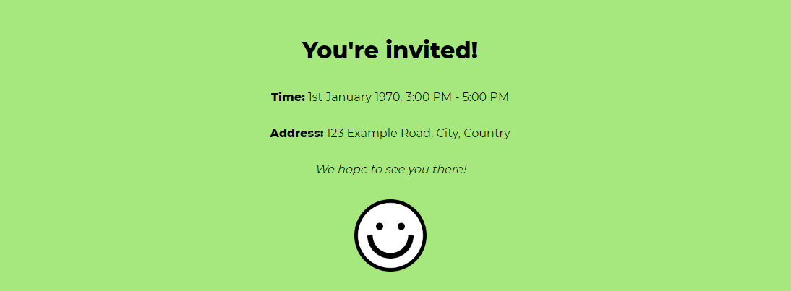

# CSS Challenge Day 1 - Invitation Card

### Challenge:
Your main goal is to style the invitation card (like the example in the image) and make it look presentable!

#### Hints:
 - Use all the CSS skils you have learned so far!
 - To remove white space aroumd the page, apply Box Model properties to the body.

#### Topics Covered:
 - Typography
 - Colors
 - Box Model

#### Other Information:
 - Card background: #a6e87d
 - Font used: Montserrat
 - Bold font weight: 800